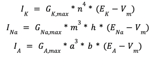

# Computational-Potassium-Modulations-in-Neurons-
This code was originally written in MatLab for my Computational Neuroscience Class

Conductance Based Model Summary

This experiment is meant to demonstrate the effect of potassium concentrations on the action potentials of a Connor Steven conductance based model. A key feature of this model is the inclusion of an outward potassium current (Miller 433) denoted by the variable IA in the experiment. Although it describes a potassium current, its behavior is more similar to the current of sodium. This can be most noted in their respective equations:  

where Gx, max is the maximum ion conductance and Vm is the membrane voltage of the neuron. 
 The following graphs were created in the controlled condition to observe the similarities between the gated variables of sodium and the outward potassium current. In the sodium channel, m is the activation gate and h is the inactivation gate. Similarly, a is the activation gated in IA  while b  is its inactivation gate. Both graphs demonstrate a significant change when the applied current is changed at 50 ms. The gates in the respective channels work in opposite directions, following the opening and closing of the respective gates to prevent the action potential from infinitely increasing. Interestingly, A’s gated variables follow the same general curve until the applied current changes from 0. At this point, the a graph begins to exponentially increase while the b graph simultaneously decreases.

The connor-steven model uses IA to slow the membrane potential (Braun 29). Thus, it decreases the rate at which the neuron depolarizes and as a result delays the firing action potentials of the neuron. The potassium ions also help re-polarize the neuron through the K+ channels. As noted in the above equation, the potassium current only has one gated variable, n, that slowly opens at the peak of the action potential curve, resulting in an outward flow of K+ ions. The last ion channel implemented is the leak channel. It is described by the following equation: Ileak = Gleak*(Eleak-Vm).  Note that there are no gated variables as this channel remains open throughout the entire action potential process. 
The connor-steven model was used to demonstrate the effects of the potassium concentration on the action potential curves, thus affecting the reversal potential of the channel. The nernst equation, EA=kbTzaqeln([Aout][Ain]) was used to create a vector of potassium reversal potentials based on varying extracellular K+ concentrations. There is very limited information about the differences between the calculations of EA and Ek. Thus, after reviewing various implementations of the Connor - Steven model, an assumption was made that the difference is minimal; the vector for the reversal potential of the A channel, EA, was created by subtracted a value of 2 from each corresponding Ek. However, this assumption may have led to discrepancies in the figures and results of the trials. In future experiments, it would be effective to compare various combinations of EA and Ek values to known graphs in order to determine their relationship in the model. 
The applied current was chosen after conducting several trials using various values ranging from 600 mV to 1250 mV. In the end, the experiment defines Iapp  as 900 mV at a specific time interval as it produces a single action potential in the control condition and the action potentials in the experimental condition are not overly crowded in the graph. The final figure title “Effect of Kout on Peak Action Potential” is used as the quantifying graph of the experiment where a relationship is established between the K+ concentrations and the peak values of the action potential graphs. 

Works Cited
Braun, Jochen. “Theoretical Neuroscience I.” https://bernstein-network.de/wp-content/uploads/2021/02/05_Lecture-05-Hodgkin-Huxley-experiments.pdf.

Cheng, Chih-Jen, et al. “Extracellular Potassium Homeostasis: Insights from Hypokalemic Periodic Paralysis.” NCBI, May 2013, https://www.ncbi.nlm.nih.gov/pmc/articles/PMC4131448/.

Dayan, Peter, and L. F. Abbott. Theoretical neuroscience : computational and mathematical modeling of neural systems. MIT Press, 2001, https://www.cmor-faculty.rice.edu/~caam415/caam415_2013/Dayan_Abbott_TheoreticalNeuroscience_Chap6.pdf.

Kispersky, Tilman J., et al. “Increase in Sodium Conductance Decreases Firing Rate and Gain in Model Neurons.” NCBI, 8 August 2012, https://www.ncbi.nlm.nih.gov/pmc/articles/PMC3427781/.

Miller, Paul. An Introductory Course in Computational Neuroscience. MIT Press, 2018.

